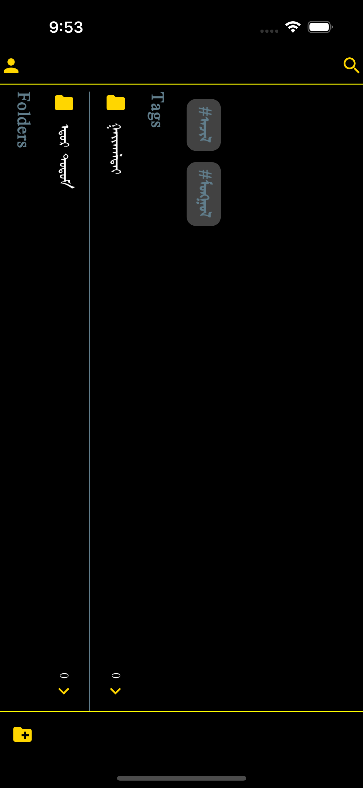
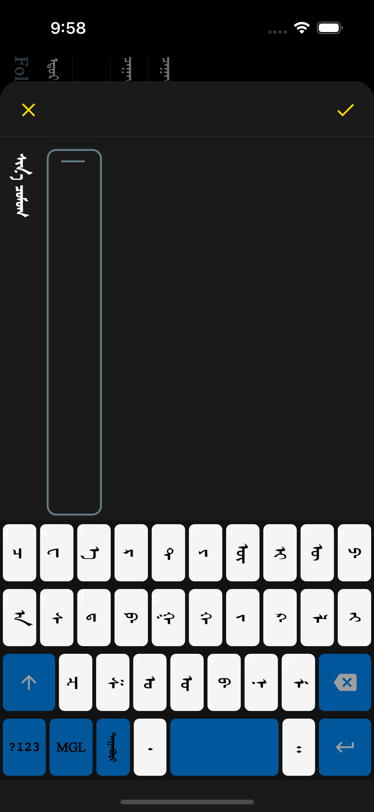

# mongol_notes

A new Flutter project.

## Mobile App Screenshots

    
    

## Getting Started

This project is a starting point for a Flutter application.

A few resources to get you started if this is your first Flutter project:

- [Lab: Write your first Flutter app](https://docs.flutter.dev/get-started/codelab)
- [Cookbook: Useful Flutter samples](https://docs.flutter.dev/cookbook)

For help getting started with Flutter development, view the
[online documentation](https://docs.flutter.dev/), which offers tutorials,
samples, guidance on mobile development, and a full API reference.

## Credits
This Mongolian Flutter App is made possible by the following projects:

- [suragch/mongol](https://github.com/suragch/mongol) - Mongolian vertical script widgets for Flutter apps 
- [suragch/mongol_code](https://github.com/suragch/mongol_code) - Unicode conversion library for traditional Mongolian script 
- [suragch/mongol-library](https://github.com/suragch/mongol-library) - A library to allow vertical script Mongolian in Android apps

## Run Example
Use flutter version 3.7.5
1. Install the `clj` command.
2. clone menu-bar repo `git clone https://github.com/amjil/mongol-menu-bar`.
3. clone menu-bar repo `git clone https://github.com/amjil/mongol-virtual-keyboard`.
4. clone menu-bar repo `git clone https://github.com/amjil/mongol-notes`.
5. Into the drafts folder `cd mongol-notes`
5. Init the example `clj -M:cljd init`
6. Open a simulator `open -a Simulator`
7. Run flutter `clj -M:cljd flutter`
